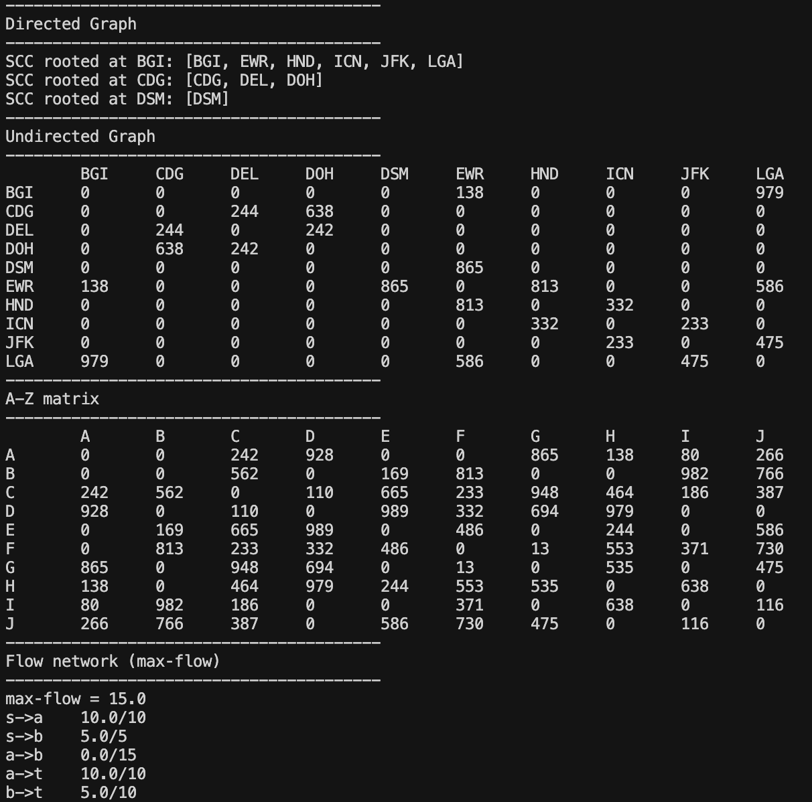

# `graph-theory`

Light‑weight, dependency‑free Python data structures and algorithms for teaching, prototyping, and solving classic graph‑theory problems:

* **Directed graphs** – adjacency‑list structure with Kosaraju strongly‑connected‑components.
* **Undirected graphs** – adjacency‑matrix implementation with BFS traversal utilities.
* **Flow networks** – capacity/flow aware digraphs with an Edmonds–Karp **max‑flow / min‑cut**.

The library is intentionally minimal, using pure standard‑library code, no C‑extensions, and no third‑party deps, so it installs instantly and runs everywhere a modern Python (3.9+) is available.

---

## Table of Contents

1. [Installation](#installation)
2. [Quick Start](#quick-start)
3. [Examples](#examples)
4. [API Overview](#api-overview)
5. [Project Status](#project-status)
6. [TODO](#todo)
7. [License](#license)

---

## Installation

**Requirements**:
- Python 3.9+
- pip 23+ (PEP 517 compatible)

```bash
# install the latest commit directly from GitHub
pip install "git+https://github.com/TurbulentRice/graph-theory.git#egg=graph-theory"
```

> **Note**: until a PyPI release is published, installation is via git URL (or cloning and `pip install -e .`).

---

## Quick Start

```python
from graph_theory import Node, DiGraph, Vertex, Edge, UndiGraph, FlowNode, Network

# --- Directed graph & SCC ------------------------------------------
air = ["JFK", "LGA", "BOS"]
routes = [("JFK", "LGA"), ("LGA", "BOS"), ("BOS", "JFK")]

g = DiGraph([Node(a) for a in air], routes)
g.expand_nodes()
for root, members in g.kosaraju_scc().items():
    print(f"SCC rooted at {root}: {members}")

# --- Undirected graph ----------------------------------------------
edges = [("JFK", "BOS", 200)]
ug = UndiGraph([Vertex(v) for v in air], [Edge(*e) for e in edges])
ug.show_matrix()

# --- Flow network ---------------------------------------------------
V = [FlowNode("s"), FlowNode("a"), FlowNode("b"), FlowNode("t")]
E = [
    ("s", "a", 10),
    ("s", "b", 5),
    ("a", "b", 15),
    ("a", "t", 10),
    ("b", "t", 10),
]
net = Network(V, E)
print("max‑flow =", net.max_flow("s", "t"))
```

---

## Examples

A full runnable demo is in **`examples/main.py`**.

```bash
# clone repo (or use your existing working copy)
git clone https://github.com/TurbulentRice/Graph_Theory.git
cd Graph_Theory

# install package in‑place (editable mode) + run example
pip install -e .
python -m examples.main
```

You’ll see: 
---

## API Overview

| Class | Purpose |
|-------|---------|
| `Node`, `DiGraph` | Directed graphs, DFS expansion, **Kosaraju SCC** |
| `Vertex`, `Edge`, `UndiGraph` | Undirected graphs via adjacency matrix + BFS |
| `FlowNode`, `Arc`, `Network` | Capacitated flow networks + **Edmonds–Karp** max‑flow |

All public names are re‑exported from the package root for one‑line imports:

```python
from graph_theory import DiGraph, UndiGraph, Network
```

Full doc‑strings live in the source files.

---

## Project Status

* **Stable**: the core APIs are small and unlikely to break.
* **Performance**: good for teaching and medium‑sized graphs (≤ 10 k vertices).  
  Heavy production workloads should consider specialised libs (e.g. NetworkX, igraph, graph‑tool).

---

## Testing

Run all tests with:

```bash
python -m unittest discover
```

## TODO

* **Packaging**
  * publish first release to PyPI (`graph-theory`)
* **Docs**
  * Generate API docs with *mkdocs‑material* or *Sphinx*
* **Algorithms**
  * Dijkstra / A* shortest‑path
  * Prim / Kruskal MST
  * Dinic or Push–Relabel max‑flow for performance comparison

---

## License

MIT – see `LICENSE` for details.